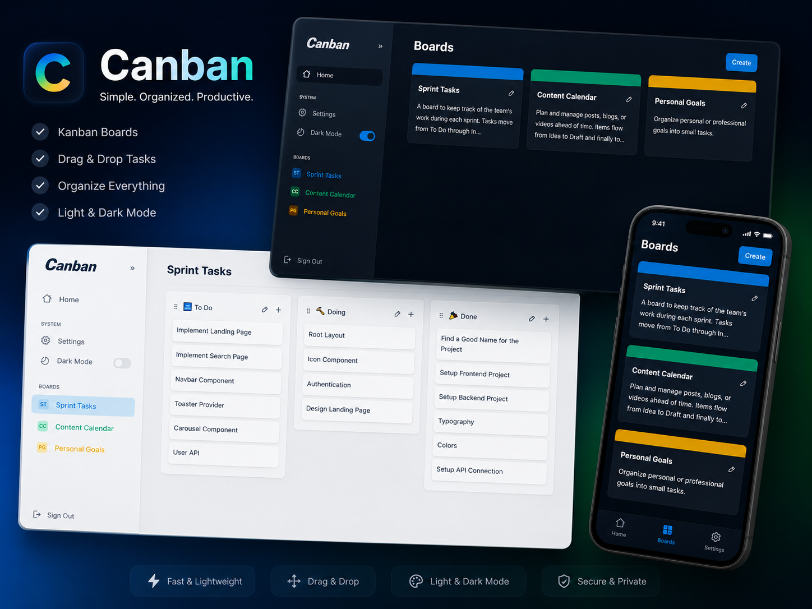

# Canban


[](https://twitter.com/intent/follow?screen_name=persiandarik)

Responsive website, responsive for all devices, built using
React, TypeScript, CSS, Zustand, Zod, TanStack Query, React Hook Form, and React
Router.

## <a style="color:orange" href="https://canban.persiandarik.ir"><strong>➥ Live Demo</strong></a>



## Prerequisites

Before you begin, ensure you have met the following requirements:

* [Git](https://git-scm.com/downloads "Download Git") must be installed on your
  operating system.

## Installing Canban

To install **Canban**, follow these steps:

Linux and macOS:

```bash
sudo git clone https://github.com/persiandarik/Canban.git
```

Windows:

```bash
git clone https://github.com/persiandarik/Canban.git
```

## Contact

If you want to contact me you can reach me
at [Twitter](https://www.twitter.com/persiandarik).

## License

This project is **Not free to use** and does not contain any license.
